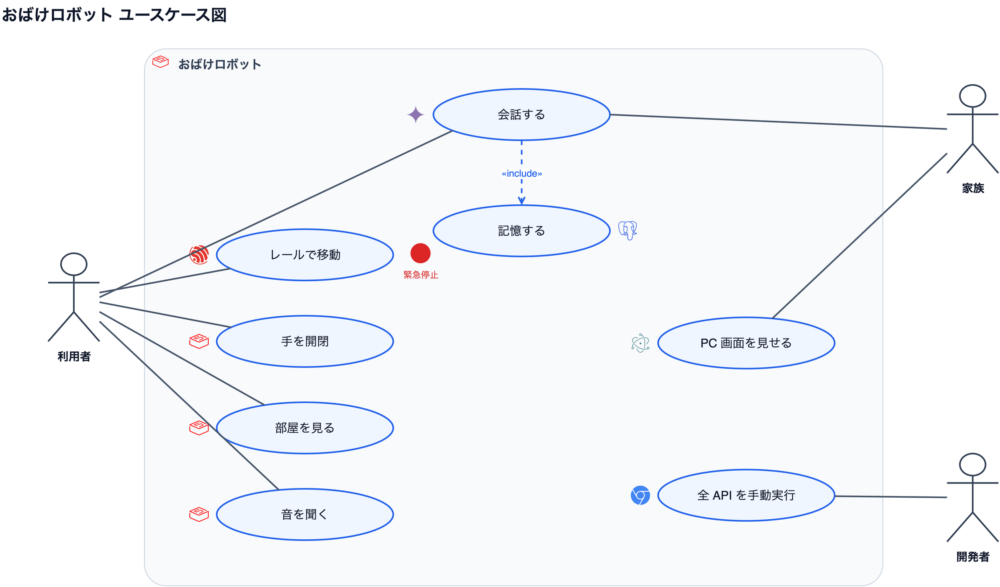
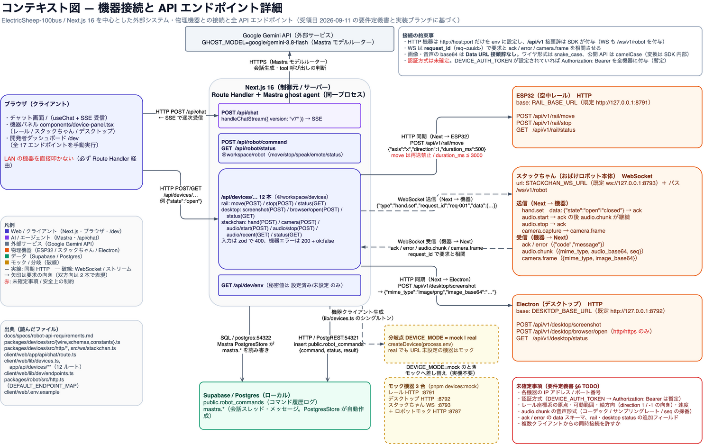
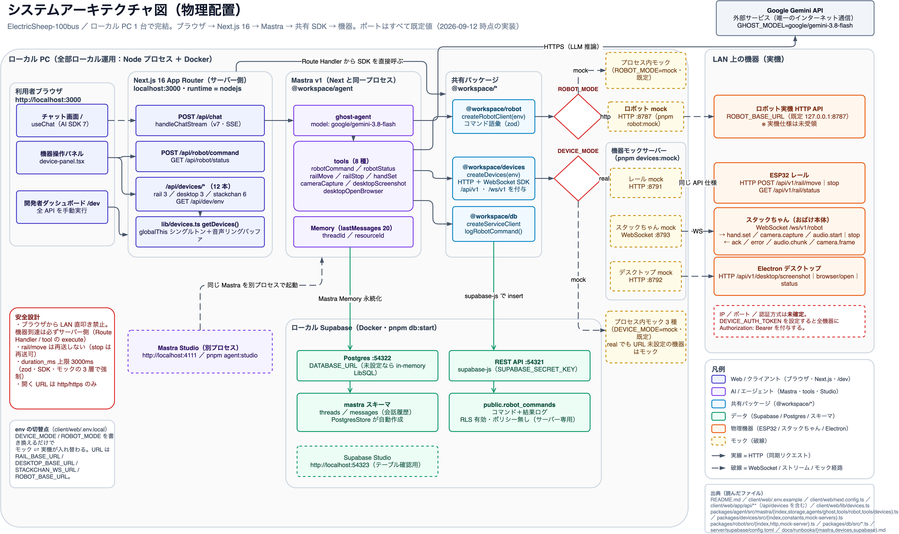
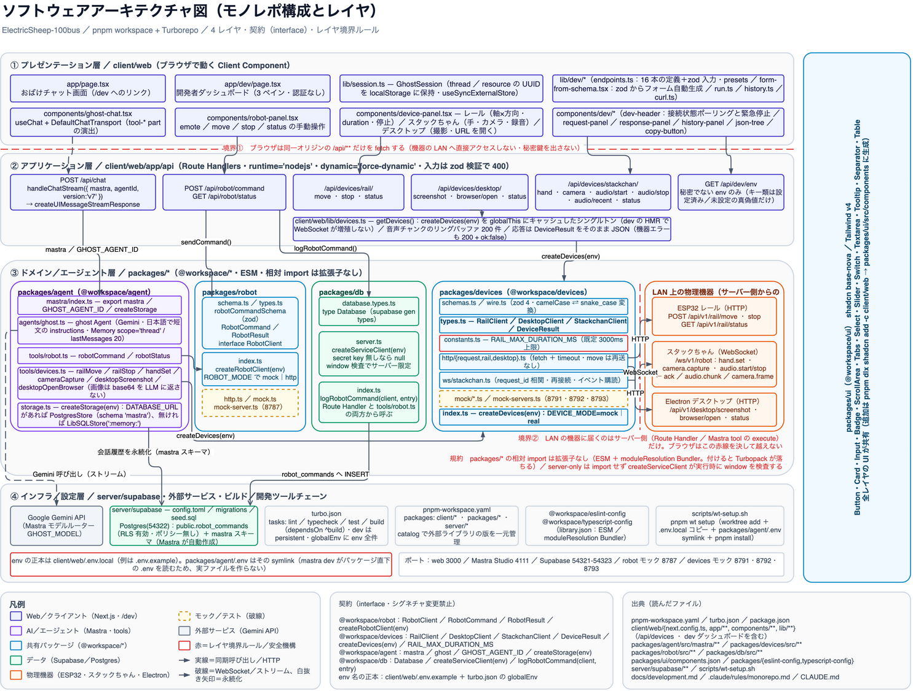
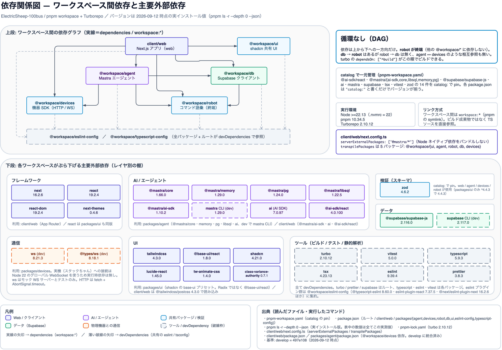
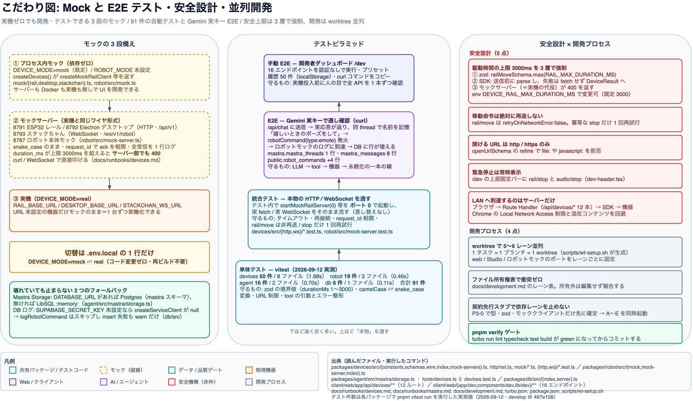

# 資料用ダイアグラム集

ハッカソン発表スライド・README・レビュー説明に使う draw.io 図の置き場。各図は `.drawio`（編集用の正本）と `.png`（貼り付け用の書き出し）の 2 点セットで管理する。

内容は **develop @ 497e108（2026-09-12 時点）** の実装を読んで作成した実測ベース。図に書いてある数値（テスト件数・エンドポイント数・ライブラリのバージョン）は推測ではなく実行結果・ファイルの実値。

## 一覧

| ファイル | 図の内容 | スライドでの使い方 |
|---|---|---|
| [`usecase.drawio`](usecase.drawio) / [`usecase.png`](usecase.png) | おばけロボットシステムのユースケース図。アクター（来場者・開発者・LLM）と、会話・動作・撮影・開発者ダッシュボードのユースケース | **冒頭の「何ができるか」**。デモの前に 1 枚出して、これから見せる体験の全体像を共有する |
| [`context.drawio`](context.drawio) / [`context.png`](context.png) | コンテキスト図。Next.js を中心にした外部システム・物理機器との接続と、全 API エンドポイント・ワイヤ形式・未確定事項 | **「外と何をやり取りしているか」**。機器チーム・審査員への仕様説明、受領した要件定義との突き合わせに使う |
| [`architecture.drawio`](architecture.drawio) / [`architecture.png`](architecture.png) | システムアーキテクチャ図（物理配置）。ブラウザ / Next.js サーバー / LAN 上の機器 / Supabase / Gemini がどのマシン・どのポートに居るか | **「どこで何が動くか」**。当日の会場ネットワーク構成の説明、トラブル時の切り分け図 |
| [`software.drawio`](software.drawio) / [`software.png`](software.png) | ソフトウェアアーキテクチャ図。モノレポ 4 レイヤ（プレゼンテーション / アプリケーション / ドメイン / インフラ）と契約・レイヤ境界ルール | **「コードの設計」**。技術審査・コードレビューの導入。レイヤ境界（赤線）が設計の主張 |
| [`dependencies.drawio`](dependencies.drawio) / [`dependencies.png`](dependencies.png) | 依存関係図。`@workspace/*` 間の依存 DAG と、レイヤ別の主要外部依存（実インストール版） | **「依存が循環していないこと」**。設計の健全性を 1 枚で示す。バージョン一覧は質疑の回答用 |
| [`quality.drawio`](quality.drawio) / [`quality.png`](quality.png) | こだわり図。3 段のモック戦略・テストピラミッド（91 件）・安全設計 5 点・並列開発プロセス 4 点 | **締めの「こだわり」**。実機ゼロで開発を回した工夫と安全側の設計をアピールする |

## 発表での推奨順

1. **ユースケース**（`usecase.png`）— 誰が何をできるのか
2. **コンテキスト**（`context.png`）— 外部システム・機器とのやり取り
3. **システムアーキテクチャ**（`architecture.png`）— 物理配置・どこで動くか
4. **ソフトウェアアーキテクチャ**（`software.png`）— コードのレイヤと契約
5. **依存関係**（`dependencies.png`）— 依存 DAG と外部ライブラリ
6. **こだわり**（`quality.png`）— モック・テスト・安全設計・並列開発

「外側 → 内側 → 作り方」の順。1〜3 は非エンジニアにも通じる粒度、4〜6 は技術審査向け。時間が短いときは 1・3・6 の 3 枚で足りる。

## 共通スタイルガイド

新しい図を足すとき・既存の図を直すときはこの配色と線種に合わせる。

### 配色（役割で決める。見た目で選ばない）

| 色 | 役割 | 塗り / 枠 |
|---|---|---|
| 青 | Web / クライアント（Next.js・ブラウザ・`/dev`） | `#EEF2FF` / `#4338CA` |
| 紫 | AI / エージェント（Mastra・tool・Gemini 呼び出し） | `#F5F3FF` / `#7C3AED` |
| 水色 | 共有パッケージ / 検証（`@workspace/*`・zod） | `#F0F9FF` / `#0284C7` |
| 緑 | データ（Supabase / Postgres）・品質ゲート | `#ECFDF5` / `#059669` |
| オレンジ | 物理機器・機器との通信（ESP32・スタックちゃん・Electron） | `#FFF7ED` / `#EA580C` |
| 黄 | モック / 分岐（`DEVICE_MODE` の切替など） | `#FEFCE8` / `#CA8A04` |
| 赤 | 安全機構・レイヤ境界・未確定事項（注意して読む場所） | `#FEF2F2` / `#DC2626` |
| グレー | ツール / devDependency / 出典・凡例 | `#FAFAFA`・`#F1F5F9` / `#CBD5E1`・`#64748B` |

矢印の線色は既定で `#475569`（スレート）。色は**役割で決める**。見た目の好みで選ばず、上の表に無い役割が出たら表ごと更新する。

### 線種

- **実線の矢印** — 同期的な呼び出し・HTTP・`dependencies`（`workspace:*`）
- **破線の矢印** — WebSocket / ストリーム（SSE・音声チャンク）
- **薄い破線の矢印** — `devDependencies`（共有の eslint / tsconfig）
- **破線の枠** — モック・テストコード・ツール（実機や本番の実体ではないもの）
- **白抜きの矢頭** — 永続化（DB への書き込み）
- 矢印の向きは**要求の向き**。双方向のやり取りは 1 本にせず 2 本で書く

### 共通の約束

- フォントは Helvetica、本文 11px / 見出し 13px。角丸は `rounded=1`
- 各図の右下に**出典ボックス**（読んだファイル・実行したコマンド・基準コミット）を必ず置く。数値を書いたらその出所も書く
- 左下に**凡例**を置く。色と線種の意味を毎回書く（単体で配れるようにする）

## 編集手順

1. draw.io デスクトップアプリで `.drawio` を開く（`open -a draw.io docs/diagrams/<name>.drawio`）
2. 編集して保存する。XML が壊れていないかは `xmllint --noout docs/diagrams/<name>.drawio` で確認
3. PNG を書き出す（リポジトリルートで実行）:

```bash
/Applications/draw.io.app/Contents/MacOS/draw.io -x -f png -o docs/diagrams/<name>.png docs/diagrams/<name>.drawio
```

`architecture` だけは細かい文字が多いため 2 倍解像度で書き出す:

```bash
/Applications/draw.io.app/Contents/MacOS/draw.io -x -f png -s 2 -o docs/diagrams/architecture.png docs/diagrams/architecture.drawio
```

4. `.drawio` と `.png` を**必ずセットでコミット**する（PNG だけ古い状態にしない）

### 実装を変えたら図も直す

図は実装のスナップショットなので、次を変えたら該当図を更新して PNG を出し直す。

- API エンドポイントの追加・削除 → `context` / `software`
- パッケージ追加・`workspace:*` 依存の変更 → `dependencies` / `software`
- ポート・env・機器の追加 → `architecture` / `context`
- テストの増減・安全上限の変更 → `quality`

出典ボックスの「基準: develop = <sha>」も同時に更新する。

## プレビュー

### ユースケース図


### コンテキスト図


### システムアーキテクチャ図


### ソフトウェアアーキテクチャ図


### 依存関係図


### こだわり図

