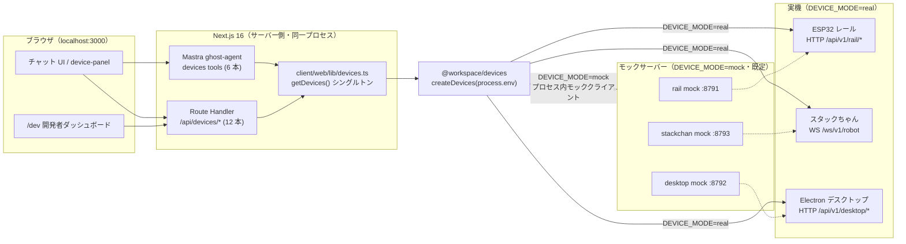

# 機器 API 接続 runbook（ESP32 / スタックちゃん / Electron）

> 対象: `@workspace/devices`（`packages/devices`）と、それを使う Next.js Route Handler・Mastra tool。
> 仕様の正本は [`docs/specs/robot-api-requirements.md`](../specs/robot-api-requirements.md)。
> 本書の記述は **すべて実装済み**（SDK・モックサーバー・Route Handler 12 本・Mastra tool 6 本・device-panel・`/dev` ダッシュボード）。`chore/integration3` で develop に統合済み。

---

## 1. 概要図



ポイント:

- **ブラウザから機器を直叩きしない**。必ず Next.js のサーバー側（Route Handler か Mastra tool の `execute`）から呼ぶ。理由は §9 のトラブルシュート「Chrome から直接叩けない理由」。
- `DEVICE_MODE=mock`（既定）のとき、`createDevices()` は**プロセス内のモッククライアント**を返す。ポート 8791/8792/8793 のモック**サーバー**は、`DEVICE_MODE=real` + `RAIL_BASE_URL` 等をモックに向けたときの接続先、および `curl` で叩いて挙動を確認するための HTTP/WS エンドポイント。
- 実機とモックサーバーは**同じ API 仕様**なので、`.env.local` の URL を差し替えるだけで切り替わる。

---

## 2. env 一覧

正本は `client/web/.env.local`（テンプレートは `client/web/.env.example`）。`packages/agent/.env` は `client/web/.env.local` への symlink（`pnpm wt setup` が作る）。

| env | 既定値 | 意味 |
| --- | --- | --- |
| `DEVICE_MODE` | `mock` | `mock` \| `real`。`mock` は全機器をプロセス内モックにする。`real` でも URL 未設定の機器はモックのまま |
| `RAIL_BASE_URL` | `http://127.0.0.1:8791` | ESP32（レール）の `http://host:port`。**`/api/v1` は付けない**（SDK が付与） |
| `DESKTOP_BASE_URL` | `http://127.0.0.1:8792` | デスクトップの `http://host:port`。同上。**モックは 8792・Electron 実機は 8801**（[`docs/ports.md`](../ports.md)） |
| `STACKCHAN_WS_URL` | `ws://127.0.0.1:8793` | スタックちゃんの `ws://host:port`。**`/ws/v1/robot` は付けない**（SDK が付与） |
| `DEVICE_AUTH_TOKEN` | 空 | 認証方式は未確定。設定されていれば全機器に `Authorization: Bearer <token>` を付与する |
| `DEVICE_RAIL_MAX_DURATION_MS` | `3000` | `rail/move` の `durationMs` 上限（安全要件）。`railMoveSchema` の `max()` に効くので、**変更したら dev を再起動**する |

補助（任意）:

| env | 既定値 | 意味 |
| --- | --- | --- |
| `DEVICE_TIMEOUT_MS` | `5000`（`DEFAULT_TIMEOUT_MS`） | HTTP 応答待ち・WS の `ack` / `camera.frame` 待ちのタイムアウト |

これらは `client/web/.env.example` と `turbo.json` の `globalEnv` に**登録済み**。`.env.example` をコピーすればそのまま使える。

### `.env.local` の雛形（機器まわりだけ）

```bash
# 機器接続モード: mock | real
DEVICE_MODE=mock

# 実機に向けるときはここを機器チームから聞いた IP:ポートに書き換える
RAIL_BASE_URL=http://127.0.0.1:8791
# モックサーバーなら 8792、Electron 実機なら 8801
DESKTOP_BASE_URL=http://127.0.0.1:8792
STACKCHAN_WS_URL=ws://127.0.0.1:8793

# 認証方式未確定。値があれば Authorization: Bearer で全機器に付与される
DEVICE_AUTH_TOKEN=

# レール駆動時間の上限（ミリ秒・安全要件）
DEVICE_RAIL_MAX_DURATION_MS=3000
```

### 実機に向ける手順

やることは **`.env.local` を書き換えて dev を再起動するだけ**。コードは触らない。

1. 機器チームから各機器の IP とポートを聞く（§8 の質問リストを使う）。
2. `client/web/.env.local` を編集する。

   ```bash
   DEVICE_MODE=real
   RAIL_BASE_URL=http://<ESP32_IP>:8080        # ← 実機の IP:ポート（例: 192.168.x.x）
   DESKTOP_BASE_URL=http://<ELECTRON_IP>:8080
   STACKCHAN_WS_URL=ws://<STACKCHAN_IP>:8080
   DEVICE_AUTH_TOKEN=<配布されたトークン。無ければ空のまま>
   ```

3. dev を再起動する（env はプロセス起動時にしか読まれない）。

   ```bash
   # 起動中の pnpm dev を Ctrl-C してから
   pnpm dev
   ```

   `.env.local` を書き換えずに**その場だけ実機（またはモックサーバー）へ向ける**なら、env を上書きして起動する。
   検証時はこの形が速い（`.env.local` は `DEVICE_MODE=mock` のまま置いておける）。

   ```bash
   DEVICE_MODE=real \
   RAIL_BASE_URL=http://127.0.0.1:8791 \
   DESKTOP_BASE_URL=http://127.0.0.1:8792 \
   STACKCHAN_WS_URL=ws://127.0.0.1:8793 \
   PORT=3000 pnpm --filter web dev
   ```

   > `DEVICE_MODE=mock`（既定）は**プロセス内のモッククライアント**なので、8791-8793 のモックサーバーには届かない。
   > モックサーバーまで含めた経路（HTTP / WebSocket・snake_case 変換・タイムアウト）を確認したいときは、必ず上の `DEVICE_MODE=real` 上書きで起動する。

4. 疎通確認: まず機器を直接 `curl`（§4）、次に Next 経由（§5）。
5. 機器を 1 台だけ実機にすることもできる。`DEVICE_MODE=real` にして、実機化しない機器の URL を空にすれば、その機器だけモックのまま動く（`createDevices` が URL 未設定の機器をモックにフォールバックする）。
6. 実機の URL が間違っている・機器が落ちている場合でも例外にはならず、各呼び出しが `{ ok: false, error: ... }` の `DeviceResult` を返す。UI と会話は止まらない。

---

## 3. モックサーバーの起動

```bash
# 3 台同時起動（rail 8791 / desktop 8792 / stackchan 8793）
# 起動前に pnpm ports:check で衝突がないか確認できる（docs/ports.md）
pnpm devices:mock
```

- 実体は `packages/devices/src/mock-servers.ts`（`startMockRailServer` / `startMockDesktopServer` / `startMockStackchanServer` / `startAllMockServers`）。ポート定数は `packages/devices/src/constants.ts` の `MOCK_RAIL_PORT` / `MOCK_DESKTOP_PORT` / `MOCK_STACKCHAN_PORT`。
- 受領仕様（`/api/v1` 付きの HTTP、`/ws/v1/robot` の WebSocket）どおりに応答する**実装済みのモック**。§4 の `curl` 例はそのまま通る。
- ルート `package.json` の `devices:mock` は `pnpm --filter @workspace/devices mock` の別名。どちらで起動してもよい。
- 起動ログ: `[devices:mock] rail listening on http://127.0.0.1:8791` のように出る。ポート衝突時は `EADDRINUSE` で落ちるので、`lsof -i :8791` で掴んでいるプロセスを確認する。

### モックが返す固定値（`constants.ts`）

| 定数 | 用途 |
| --- | --- |
| `MOCK_PNG_BASE64` | スクリーンショット / `camera.frame` が返す 1x1 透明 PNG（Data URL 接頭辞なし） |
| `MOCK_AUDIO_CHUNK_BASE64` | `audio.chunk` が返す無音ダミー |
| `MOCK_AUDIO_CHUNK_INTERVAL_MS`（100） | `audio.start` 後にチャンクを送る間隔 |

---

## 4. モック機器を直接叩く（curl / WebSocket）

機器そのものの API（`/api/v1` 付き）を確認するときはこちら。Next を経由しないので、SDK・Route Handler のバグと機器側の問題を切り分けられる。

> 実機に向けるときは `127.0.0.1:879x` を実機の IP:ポートに読み替える。`DEVICE_AUTH_TOKEN` を使う構成なら `-H "Authorization: Bearer $DEVICE_AUTH_TOKEN"` を足す。

### 4.1 レール（ESP32・8791）

```bash
# 移動（x 軸を + 方向に 500ms）※ ワイヤ形式は snake_case
curl -sS -X POST http://127.0.0.1:8791/api/v1/rail/move \
  -H 'content-type: application/json' \
  -d '{"axis":"x","direction":1,"duration_ms":500}'

# 停止（JSON ボディ必須・冪等）※ axis:null で全軸、"x" で単軸
curl -sS -X POST http://127.0.0.1:8791/api/v1/rail/stop \
  -H 'content-type: application/json' \
  -d '{"axis":null}'
# => 202 {"command_id":"http-...","status":"accepted"}

# 状態
curl -sS http://127.0.0.1:8791/api/v1/rail/status
# => {"type":"status","mode":"led_preview","simulated":true,"axes":[{"axis":"x","active":false,...}],...}
```

#### 実機ファームとの対応（`firmware/esp32-rail/firmware/rail_dc`）

モックは実機ファーム [`firmware/esp32-rail/firmware/rail_dc`](../../firmware/esp32-rail/firmware/rail_dc) の応答形に合わせてある。実機の振る舞いで押さえるところ:

- **`stop` は JSON ボディ必須**。`content-type: application/json` と `{"axis":null}`（全軸）／`{"axis":"x"}`（単軸）が要る。空ボディは 400。SDK の `createRailClient().stop()` は自動で `{"axis":null}` を送る（単軸は `stop(signal, "x")`）
- **`move` / `stop` は 202 の非同期受理**。`{"command_id":"http-...","status":"accepted"}` が返るだけで、走行完了の保証ではない。SDK は `DeviceResult.data.commandId` に載せる
- **`status` に `state` は無い**。`axes[].active` のいずれかが true なら `moving`、そうでなければ `stopped` を SDK が導出する
- **`MOTOR_OUTPUTS_ENABLED` が false のうちはモーター出力が出ない**。内蔵 WS2812 の LED プレビュー（X=赤 / Y=緑 / Z=青）だけが動き、`status` は `simulated: true` / `mode: "led_preview"` を返す。実機運転は配線後にこの定数を true にして再書き込みする
- `duration_ms` の上限はファームが 60000、SDK は 3000（安全側）。`move` の不正入力はファームでは 422

書き込み手順・SSID 運用・差分表の全体は [`firmware/README.md`](../../firmware/README.md)。

### 4.2 デスクトップ（モック・8792 / Electron 実機は 8801）

```bash
# スクリーンショット（POST・ボディなし）→ base64（Data URL 接頭辞なし）
curl -sS -X POST http://127.0.0.1:8792/api/v1/desktop/screenshot
# => {"mime_type":"image/png","image_base64":"iVBORw0KGgo..."}

# base64 を PNG に落として目視する
curl -sS -X POST http://127.0.0.1:8792/api/v1/desktop/screenshot \
  | python3 -c 'import sys,json,base64;d=json.load(sys.stdin);open("/tmp/shot.png","wb").write(base64.b64decode(d["image_base64"]))'
open /tmp/shot.png

# ブラウザで URL を開く（http/https のみ）
curl -sS -X POST http://127.0.0.1:8792/api/v1/desktop/browser/open \
  -H 'content-type: application/json' \
  -d '{"url":"https://example.com"}'

# 状態
curl -sS http://127.0.0.1:8792/api/v1/desktop/status
# => {"state":"running", ...}
```

### 4.3 スタックちゃん（WebSocket・8793 / パス `/ws/v1/robot`）

`websocat` があるなら:

```bash
# インストール: brew install websocat
websocat ws://127.0.0.1:8793/ws/v1/robot
# 接続後、1 行ずつ JSON を貼って Enter
{"type":"hand.set","request_id":"req-001","data":{"state":"open"}}
{"type":"camera.capture","request_id":"req-002"}
{"type":"audio.start","request_id":"req-003"}
{"type":"audio.stop","request_id":"req-004"}
```

Node 22+ のグローバル `WebSocket` を使うワンライナー（追加インストール不要）:

```bash
node -e '
const ws = new WebSocket("ws://127.0.0.1:8793/ws/v1/robot");
ws.onopen = () => {
  console.log("open");
  ws.send(JSON.stringify({ type: "hand.set", request_id: "req-001", data: { state: "open" } }));
  ws.send(JSON.stringify({ type: "camera.capture", request_id: "req-002" }));
};
ws.onmessage = (e) => console.log("recv", String(e.data).slice(0, 200));
ws.onerror = (e) => console.error("error", e.message ?? e);
setTimeout(() => ws.close(), 3000);
'
```

期待する受信（`request_id` が送信と一致すること）:

```json
{"type":"ack","request_id":"req-001","data":{}}
{"type":"camera.frame","request_id":"req-002","data":{"mime_type":"image/png","image_base64":"iVBORw0..."}}
```

`audio.start` を送ると `ack` の後、`audio.stop` まで `audio.chunk` が約 100ms 間隔で流れ続ける。

---

## 5. Next 経由の API 一覧（`/api/devices/*`）

**12 本すべて実装済み**。実体は `client/web/app/api/devices/...`、接続は `client/web/lib/devices.ts` の `getDevices()`（`globalThis` キャッシュのシングルトン。HMR で WebSocket が増殖しないようにする）。

共通仕様:

- `export const dynamic = 'force-dynamic'`（キャッシュさせない）。
- 入力は zod で検証し、不正なら **HTTP 400**。
- 成功・失敗いずれも本文は `DeviceResult` をそのまま JSON 化した形。

```ts
interface DeviceResult<T = unknown> {
  ok: boolean
  status?: number   // 機器から返った HTTP ステータス
  data?: T
  error?: string
  latencyMs: number
}
```

- **公開 API は camelCase**（`durationMs` / `mimeType` / `imageBase64`）。機器側の snake_case への変換は SDK の `src/wire.ts` が行うので、Next のリクエスト/レスポンスに snake_case は出てこない。

| メソッド | パス | 入力 JSON | `data` |
| --- | --- | --- | --- |
| POST | `/api/devices/rail/move` | `{"axis":"x","direction":1,"durationMs":500}` | 受理結果 |
| POST | `/api/devices/rail/stop` | なし | 受理結果 |
| GET | `/api/devices/rail/status` | なし | `{"state":"moving"\|"stopped"\|"error", ...}` |
| POST | `/api/devices/desktop/screenshot` | なし | `{"mimeType":"image/png","imageBase64":"..."}` |
| POST | `/api/devices/desktop/browser/open` | `{"url":"https://example.com"}` | 受理結果 |
| GET | `/api/devices/desktop/status` | なし | `{"state":"running", ...}` |
| POST | `/api/devices/stackchan/hand` | `{"state":"open"}` / `{"state":"closed"}` | `ack` の内容 |
| POST | `/api/devices/stackchan/camera` | なし | `{"mimeType":"image/png","imageBase64":"..."}` |
| POST | `/api/devices/stackchan/audio/start` | なし | 受理結果 |
| POST | `/api/devices/stackchan/audio/stop` | なし | 受理結果 |
| GET | `/api/devices/stackchan/audio/recent` | クエリ `?limit=`（**既定 20**・上限 200） | `{"chunks": AudioChunk[]}` を**新しい順**で返す。リングバッファ容量は **200**（`AUDIO_BUFFER_CAPACITY`）で、溢れた古いチャンクから捨てる |
| GET | `/api/devices/stackchan/status` | なし | `{"connected":true\|false}` |

### curl 例（web を `pnpm dev` で 3000 に起動した状態）

```bash
# レール移動
curl -sS -X POST http://localhost:3000/api/devices/rail/move \
  -H 'content-type: application/json' \
  -d '{"axis":"x","direction":1,"durationMs":500}'
# => {"ok":true,"status":200,"data":{"accepted":true},"latencyMs":3}

# 上限超過（DEVICE_RAIL_MAX_DURATION_MS=3000 のとき）→ 400
curl -sS -i -X POST http://localhost:3000/api/devices/rail/move \
  -H 'content-type: application/json' \
  -d '{"axis":"x","direction":1,"durationMs":99999}'

# 停止
curl -sS -X POST http://localhost:3000/api/devices/rail/stop

# 状態
curl -sS http://localhost:3000/api/devices/rail/status

# スクリーンショット（画像は data.imageBase64）
curl -sS -X POST http://localhost:3000/api/devices/desktop/screenshot | head -c 200

# ブラウザで開く（http/https 以外は 400）
curl -sS -X POST http://localhost:3000/api/devices/desktop/browser/open \
  -H 'content-type: application/json' -d '{"url":"https://example.com"}'
curl -sS -i -X POST http://localhost:3000/api/devices/desktop/browser/open \
  -H 'content-type: application/json' -d '{"url":"file:///etc/passwd"}'   # => 400

# 手を開く / 閉じる
curl -sS -X POST http://localhost:3000/api/devices/stackchan/hand \
  -H 'content-type: application/json' -d '{"state":"open"}'

# カメラ撮影
curl -sS -X POST http://localhost:3000/api/devices/stackchan/camera | head -c 200

# 録音開始 → 直近チャンク確認 → 停止
curl -sS -X POST http://localhost:3000/api/devices/stackchan/audio/start
curl -sS http://localhost:3000/api/devices/stackchan/audio/recent | head -c 300
curl -sS -X POST http://localhost:3000/api/devices/stackchan/audio/stop

# WS 接続状態
curl -sS http://localhost:3000/api/devices/stackchan/status
```

---

## 6. Mastra tools 一覧

**6 本すべて実装済み**。実体は `packages/agent/src/mastra/tools/devices.ts`。詳細な入出力スキーマは [`docs/runbooks/mastra.md`](./mastra.md#機器-devices-tools6-本) を参照。`createDevices(process.env)` はモジュールスコープでメモ化する。

| tool | 入力 | 返すもの | 対応する機器操作 |
| --- | --- | --- | --- |
| `railMove` | `{ axis: 'x'\|'y'\|'z', direction: 'plus'\|'minus', durationMs }` | `DeviceResult`（`data` 抜き） | `POST /rail/move` |
| `railStop` | なし | `DeviceResult` | `POST /rail/stop` |
| `handSet` | `{ state: 'open'\|'closed' }` | `DeviceResult` | WS `hand.set` → `ack` |
| `cameraCapture` | なし | **画像 base64 は返さない**。撮影成否とサイズだけ | WS `camera.capture` → `camera.frame` |
| `desktopScreenshot` | なし | 同上（成否・サイズのみ） | `POST /desktop/screenshot` |
| `desktopOpenBrowser` | `{ url }`（http/https のみ） | `DeviceResult` | `POST /desktop/browser/open` |

> 画像を LLM の文脈に流し込むとトークンを食いつぶすため、`cameraCapture` / `desktopScreenshot` は「撮れた・何バイト」だけをエージェントに返す。**画像そのものは Route Handler（§5）経由で UI に表示する**。

> **`direction` は LLM には `plus` / `minus` の文字列で見せる**（Gemini の function declaration が数値リテラルの union を扱えないことがあるため）。tool 内部で `+1` / `-1` に変換してから `railMoveSchema` に通す。機器へのワイヤ形式は `direction: 1 | -1`。

> **移動は必ず `railMove`**。ghost の instructions に「robotCommand の `move` は使わない（robotCommand は emote / speak / stop 用）」と明記してある。

### 会話例

| 来場者の発話 | 呼ばれる tool |
| --- | --- |
| 「ちょっと右に動いて」 | `railMove { axis:'x', direction:'plus', durationMs:500 }` |
| 「止まって！」 | `railStop` |
| 「手を開いてみて」 | `handSet { state:'open' }` |
| 「手を握って」 | `handSet { state:'closed' }` |
| 「今なにが見えてる？」 | `cameraCapture` → 「撮れたよ！画面に出したね」 |
| 「私の PC の画面見て」 | `desktopScreenshot` |
| 「Google 開いて」 | `desktopOpenBrowser { url:'https://www.google.com' }` |

UI では AI SDK の `tool-railMove` 等の part を拾って「ロボットが動いています」を演出する（`client/web/app/page.tsx`）。part 名は `ghost.ts` の `tools: { ... }` のキー名（`railMove` / `railStop` / `handSet` / `cameraCapture` / `desktopScreenshot` / `desktopOpenBrowser`）。

---

## 7. 安全要件の実装マッピング

| 安全要件 | 実装箇所 | 挙動 |
| --- | --- | --- |
| **駆動時間の上限** | `packages/devices/src/constants.ts` の `RAIL_MAX_DURATION_MS`（`DEVICE_RAIL_MAX_DURATION_MS ?? 3000`）→ `schemas.ts` の `railMoveSchema.durationMs = z.number().int().min(1).max(RAIL_MAX_DURATION_MS)` | 上限超過は**機器へ送る前に**バリデーションで弾く。Route Handler は 400、Mastra tool は入力スキーマ違反で実行されない |
| **移動命令の自動再送禁止** | `createRailClient().move`（`packages/devices/src/http.ts`） | `rail/move` は**リトライしない**（機器が受理済みで二重移動になる危険）。タイムアウト・ネットワークエラーでもそのまま `{ok:false}` を返す。`rail/stop` は冪等なので 1 回だけリトライする |
| **URL の限定** | `schemas.ts` の `openUrlSchema`（`.url()` + `/^https?:\/\//` の `refine`） | `file:` / `javascript:` / `data:` は 400。Route Handler と Mastra tool の両方が同じスキーマを使う |
| **停止の常時受付** | `rail/stop` は冪等・リトライ可（ファーム互換のため SDK が `{"axis":null}` のボディを付ける）。`/dev` ダッシュボードは `rail/stop` と `audio/stop` を**画面上部に固定した緊急ボタン**として常時表示。`device-panel.tsx` にも停止ボタンがある | どの画面・どの状態からでも 1 クリックで停止できる |
| **タイムアウト** | `DEFAULT_TIMEOUT_MS`（**5000ms**・env `DEVICE_TIMEOUT_MS` で変更）、HTTP は `AbortSignal.timeout`、WS は `ack` / `camera.frame` の待ち受けにタイマー | 応答が来なくてもハングしない |
| **認証** | `createDevices` の `resolveHeaders`（`DEVICE_AUTH_TOKEN` → `Authorization: Bearer`） | 方式未確定のため暫定。§8 で確認する |
| **障害時の扱い** | 全公開 API が `DeviceResult` を返す。`createDevices` は実クライアント生成に失敗するとモックへフォールバックし警告ログを出す | 機器が落ちていても会話と UI は継続する |
| **接続管理** | `client/web/lib/devices.ts` の `getDevices()`（`globalThis` シングルトン・lazy connect）。Mastra tool 側は `packages/agent/src/mastra/tools/devices.ts` の `getDevices()`（モジュールスコープでメモ化） | dev の HMR で WebSocket が増殖しない |

---

## 8. 未確定事項チェックリスト（機器チームへの質問）

回答が得られたら `docs/specs/robot-api-requirements.md` の「未確定事項」と本書を更新する。

- [ ] **IP アドレス**: ESP32 / スタックちゃん / Electron のそれぞれの IP は？ DHCP か固定か（DHCP なら mDNS 名 `xxx.local` はあるか）
- [ ] **ポート番号**: 各機器の待ち受けポートは？（HTTP 2 台と WS 1 台。SDK 既定はモックの 8791/8792/8793。実機ブリッジは 8801 以降＝[`docs/ports.md`](../ports.md)）
- [ ] **認証方式**: 認証はあるか。あるなら `Authorization: Bearer <token>` でよいか、別ヘッダ・クエリ・mTLS か。トークンの配布方法と有効期限は？
- [ ] **軸方向**: `axis` の `x` / `y` / `z` はそれぞれ物理的にどの向きか。`direction: 1` はどちら向きか（右/左、前/後、上/下）。原点・可動範囲・リミットスイッチの有無は？
- [ ] **速度**: 速度は固定か指定できるか。`duration_ms` 500 で実際に何 cm 動くか。安全な上限（現在の既定 3000ms）は妥当か
- [ ] **音声形式**: `audio.chunk` のコーデック・サンプリングレート・チャンネル数・1 チャンクの長さ。`seq` の採番規則（0 始まりか 1 始まりか、欠番はあるか）。`audio_base64` は生 PCM か圧縮済みか
- [ ] **対象ディスプレイ**: `desktop/screenshot` はどのディスプレイを撮るか（マルチモニタ時）。指定できるか。解像度・画像形式（PNG 固定か）。`desktop/browser/open` はどのブラウザで開くか、既存ウィンドウを再利用するか
- [ ] **`ack` / `error` の詳細スキーマ**: `error.code` の体系（値の一覧）と `ack.data` に入る内容
- [ ] **`rail/status` / `desktop/status` の追加フィールド**: `state` 以外に何が返るか
- [ ] **同時接続**: WebSocket / HTTP に複数クライアントが同時接続してよいか。排他制御はどちら側の責務か
- [ ] **ネットワーク**: 開発 PC と機器は同一 LAN / 同一 Wi-Fi SSID か。ゲスト Wi-Fi のクライアント分離は無効か

---

## 9. トラブルシュート

### 接続拒否（`ECONNREFUSED` / `fetch failed`）

- モック運用のつもりなら、モックサーバーが起動しているか（`pnpm devices:mock`）。**`DEVICE_MODE=mock` はプロセス内モックなのでモックサーバーには届かない**（届かせたいなら `DEVICE_MODE=real` + URL をモックに向ける）。`pnpm ports:check` で待ち受けを確認。
- `RAIL_BASE_URL` に **`/api/v1` を付けていないか**。付けると `/api/v1/api/v1/rail/move` になって 404 になる。ベース URL は `http://host:port` まで。
- `DEVICE_MODE=real` にしたのに URL が空 → その機器は**モックのまま**動く（これは仕様）。ログの `[devices] ... モックを使用します` を確認。
- 実機の IP が変わった（DHCP）。§8 の IP を再確認。

### タイムアウト（応答が返らない）

- 既定 5000ms（`DEFAULT_TIMEOUT_MS` / `DEVICE_TIMEOUT_MS`）。機器が重い処理（スクリーンショット等）をするなら `DEVICE_TIMEOUT_MS` を伸ばす。
- `DeviceResult` は `ok:false` + `error` + `latencyMs` で返る。`latencyMs` がちょうどタイムアウト値ならこちら側で切っている、明らかに短ければ機器が即エラーを返している。
- **`rail/move` はタイムアウトしてもリトライしない**（安全要件）。機器が受理済みかもしれないので、不安なら `rail/stop` を送る。

### WS が `ack` を返さない

- 接続先パスを確認する。`STACKCHAN_WS_URL` は `ws://host:port` まで。`/ws/v1/robot` は SDK が付ける。手で `websocat` を叩くときは**パスを含めて** `ws://127.0.0.1:8793/ws/v1/robot`。
- 送信 JSON のエンベロープが `{ type, request_id, data }` になっているか。`request_id` が欠けていると `stackchanOutboundSchema` で弾かれる。
- SDK が採番する `request_id` は `req-<uuid>`（`createRequestId()`）。機器が `req-001` 形式を返してきても、**受信側は非空文字列まで緩めてある**（`inboundRequestIdSchema`）ので受け取れる。
- **`request_id` のフォールバック**: 機器が `ack` / `camera.frame` に `request_id` を付けずに返した場合、SDK は「その種別を待っている最も古い 1 件」に対応づける（`request_id` が一致するものが無いときだけ）。1 リクエストずつなら機器が ID をエコーしなくても動く。ただし**並行リクエストでは取り違えうる**ので、実機仕様が固まったら §8 で確認する。
- `wss://`（TLS）が必要な機器に `ws://` で繋いでいないか。
- 接続はできるが応答が無い場合、機器側が別クライアントに占有されている可能性（§8 の「同時接続」）。

### `request_id` 不一致

- SDK は送信時の `request_id` で応答を相関させる。機器が**別の ID を返す**、あるいは `ack` を返さず `camera.frame` だけ返すと、待ち受けがタイムアウトする。
- 切り分け: `onEvent` で inbound を全部ログに出す（受信生データが見える）か、`websocat` で生のやり取りを観察する。
- 機器側が `request_id` をエコーしない仕様なら、SDK 側の相関方式を変える必要がある → 機器チームに確認（§8）。
- 受信 JSON が壊れている / スキーマに合わない場合、`parseStackchanInbound` は例外にせず `null` を返して無視する。「何も起きていないように見える」ときはここを疑う。

### LAN 到達性

```bash
# 疎通
ping -c 3 <ESP32_IP>
# ポートが開いているか（macOS 標準の nc）
nc -zv <ESP32_IP> 8080
# HTTP が返るか（ヘッダだけ）
curl -sS -i --max-time 3 http://<ESP32_IP>:8080/api/v1/rail/status
```

- 開発 PC と機器が**同じサブネット**にいるか（`ifconfig | grep 'inet '`）。
- Wi-Fi の**クライアント分離（AP isolation）**が有効だと端末間通信ができない。ゲスト SSID で起きがち。
- macOS のファイアウォールは外向きは基本ブロックしないが、VPN が有効だと LAN 宛が VPN に吸われることがある。切って試す。
- 機器が `127.0.0.1` にだけバインドしていると LAN からは届かない（機器側の設定）。

### Chrome から直接叩けない理由

ブラウザの JS から `http://<ESP32_IP>:8080/...` を直接 `fetch` してはいけない。

- **CORS**: 機器側が `Access-Control-Allow-Origin` を返さないので、`localhost:3000` 由来のリクエストはブロックされる。
- **Local Network Access**（Chrome 142 以降）: パブリック／ローカル間のリクエストに**事前の許可プロンプト**が必要になり、プリフライトも増える。ハッカソン当日の実機で確実に動く前提にできない。
- **Mixed Content**: ページが https のとき `http://` の機器へは繋げない。
- **認証情報**: `DEVICE_AUTH_TOKEN` をブラウザに配ると漏れる。

したがって**機器への到達は必ずサーバー側**（Route Handler / Mastra tool の `execute`）で行い、ブラウザは `/api/devices/*`（同一オリジン）だけを叩く。`/dev` ダッシュボードも同じ経路を使う。

---

## 10. 関連ドキュメント

- 仕様の正本: [`docs/specs/robot-api-requirements.md`](../specs/robot-api-requirements.md)
- 開発者ダッシュボード: [`docs/runbooks/dev-dashboard.md`](./dev-dashboard.md)
- SDK 実体: `packages/devices/src/{index,constants,schemas,types,wire,mock-servers}.ts`、モッククライアントは `packages/devices/src/mock/`
